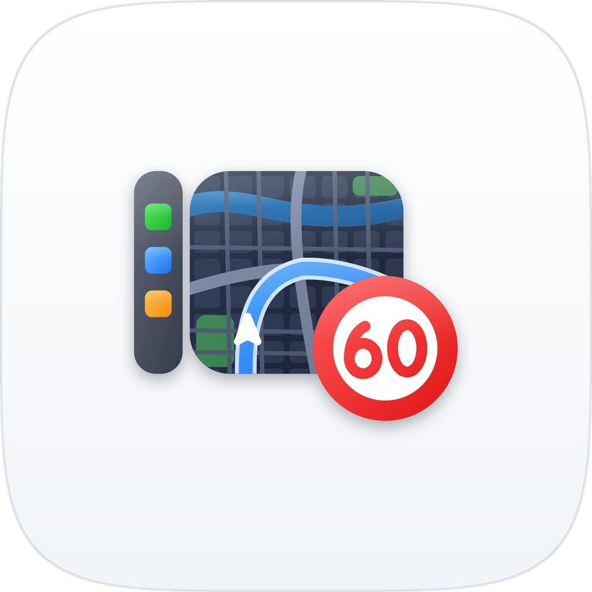

# CarSpeed

Bong bóng tốc độ nổi (tốc độ hiện tại + biển giới hạn tốc độ lấy từ app dẫn đường **Vietmap Live** hoặc **GOFA**) khi app đó đang chạy nền.
Tách ra từ tính năng bong bóng tốc độ của CarDuo (SplitCarPlay), bỏ toàn bộ phần chia màn hình.

- Dopamine rootless, iOS 15.0 – 16.6.1 (build với SDK 16.5)
- Có xe CarPlay: bong bóng **chỉ** nằm trên màn xe, không hiện trên iPhone. Không có xe: nằm trên iPhone (xoay theo hướng máy).
- Chỉ hiện sau khi đã mở app dẫn đường (trên iPhone hoặc CarPlay) rồi chuyển app đó xuống chạy nền; app tự chạy nền mà chưa được mở thì không hiện (kể cả khi CarPlay tự khởi chạy app để vẽ bản đồ trên Dashboard / màn đồng hồ lúc xe kết nối). Không đọc được tốc độ / giới hạn thì hiện `--`. Chỉ ẩn khi app dẫn đường hiện lại (trên iPhone hoặc CarPlay) hoặc khi app bị tắt.

| App | Bundle ID |
| --- | --- |
| Vietmap Live | `vn.vietmap.live` |
| GOFA | `com.lumi.GOFA` |

Thêm app khác: thêm bundle ID vào **cuối** `SPP_NAV_APPS` / `SPP_NAV_APP_NAMES` (`src/common.h`), vào `CarSpeed.plist`, thêm khoá bật/tắt trong `SPPPrefs.mm`, `carspeedprefs/Resources/Root.plist` và 2 file `Localizable.strings` (vi/en).

## Thao tác

| Thao tác | Kết quả |
| --- | --- |
| Kéo | Di chuyển bong bóng (nhớ vị trí riêng cho iPhone / xe) |
| 2 ngón | Phóng to / thu nhỏ, lưu riêng cho iPhone / CarPlay (đồng bộ với Cài đặt) |
| Chạm | Mở lại app đang cấp tốc độ (trên xe: giao diện CarPlay của app) |
| Giữ 2 giây | Viền đỏ chạy quanh bong bóng, chạy hết vòng thì thoát hẳn app đó (thả tay sớm để huỷ) |

Cài đặt > CarSpeed (Tiếng Việt / English, mặc định theo ngôn ngữ máy; đổi bằng nút quả địa cầu trên thanh điều hướng):

| Nhóm | Mục |
| --- | --- |
| Chung | Bật CarSpeed |
| Giao diện | Kiểu hiển thị · Hiện icon app · Xem thử 10 giây |
| Kích thước | Trên iPhone · Trên CarPlay (60–220, 100 = mặc định) · Đặt lại vị trí & kích thước |
| Nguồn tốc độ | Vietmap Live · GOFA |

18 kiểu, kiểu nào cũng có icon của app đang cấp tốc độ: Thẻ ngang, Đĩa nhỏ, Biển báo lớn, Đồng hồ, Thanh HUD, Màu theo tốc độ, Cột dọc, Viên thuốc đôi, Neon, Thanh đo, Chữ nổi (không nền), Thẻ sáng, và nhóm lấy ý tưởng từ xe hơi theo phong cách HarmonyOS: Vô lăng, Bánh xe (mâm quay theo tốc độ), Thẻ HarmonyOS, Đồng hồ kim, Vòng kép HarmonyOS, Live View.

Icon: `carspeedprefs/Resources/icon*.png` (Cài đặt), `CarSpeed.png` (icon gói trong Sileo/Zebra), `logo*.png` (thẻ đầu trang Cài đặt, thu nhỏ từ `assets/icon-1024.png`), bản gốc `assets/icon-1024.png` — kiểu HarmonyOS: màn CarPlay có bản đồ đêm chi tiết (dock 3 app màu, khu phố, sông, công viên, đường chính, lộ trình xanh, mũi tên xe) với biển giới hạn 60 nổi ở góc, trên nền squircle trắng; vẽ bằng `harmony_icon.py` của skill ios-tweak-format.

## Phát hành

Đổi `Version` trong `control` (và `CFBundleShortVersionString` trong `carspeedprefs/Resources/Info.plist`), commit, rồi `git tag v<Version> && git push --tags`. CI build bản release (`FINALPACKAGE=1`) và đính `CarSpeed_<Version>_rootless.deb` vào GitHub Release. Gói mới tự gỡ bản cũ `com.anlai97.speedpop` khi cài (Conflicts/Replaces); cài đặt cũ không được chuyển sang.

## Cách hoạt động

| Process | File | Việc |
| --- | --- | --- |
| Vietmap Live / GOFA | `src/hooks/NavApp.xm` | GPS riêng (khi app bật GPS) + quét màn hình lấy giới hạn → Darwin notify `carspeed.speed` (kèm chỉ số app) |
| SpringBoard | `src/hooks/SpringBoard.xm`, `src/SPPBubble.mm` | Nhận tốc độ, vẽ bong bóng trên cửa sổ riêng (màn xe nếu có CarPlay, ngược lại iPhone) |
| CarPlay (`com.apple.CarPlayApp`) | `src/hooks/CarPlay.xm` | Chạm bong bóng trên xe → mở đúng app qua `DBDashboard handleEvent:` |

Log: `/var/mobile/Documents/CarSpeed.log` (xem bằng Filza).

## Build

Không cần Theos trên máy: push lên GitHub, workflow `.github/workflows/build.yml` build trên macOS và đưa file `.deb` vào mục Artifacts của lần chạy.

Nếu đang cài CarDuo thì tắt bong bóng tốc độ trong Cài đặt CarDuo để không bị 2 bong bóng.
